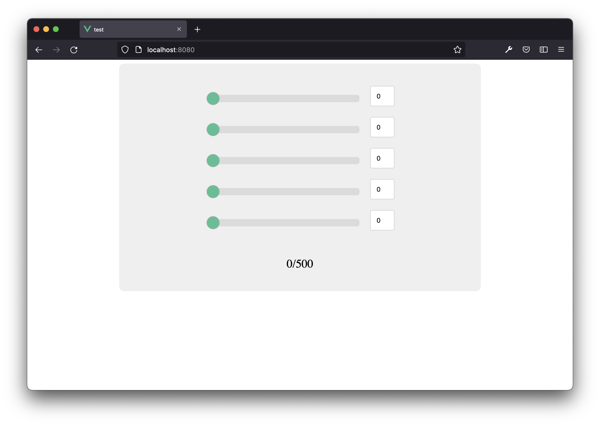

# Sliders

## Component communication

**Create a new project sliders”. The project should contain 5 sliders that range from 0 to 100**

**Try to structure your app in reasonable size of components.
Find parts in the UI, which gets repeated and structure these in components.**

**Also try to apply stylings to your components by using css classes.**

**Use `props`to pass data to child components.**
**Use `events`to pass data to parent components.**

## Reference ##
- Slider CSS https://www.w3schools.com/howto/howto_js_rangeslider.asp

## Bonus ##

- Add a label in the bottom with the sum of the values from the 5 sliders
- Allow the input to the right of the slider to also edit the slider value instead of just displaying
